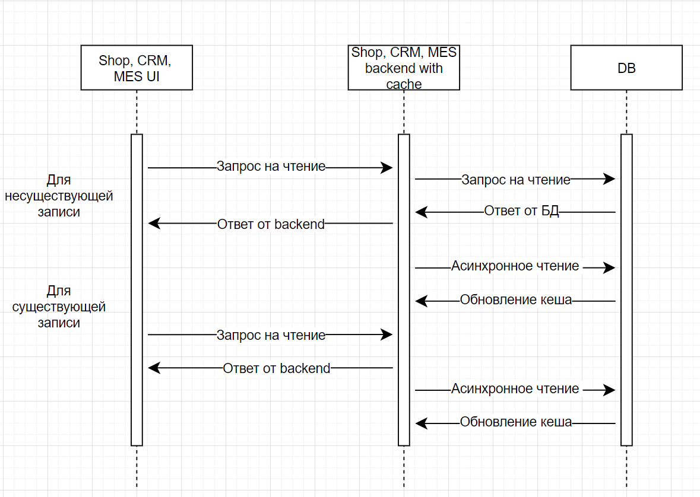

# Кеширование   

## Мотивация    
Для снижения нагрузки на распределенную систему, повышения скорости получения ответа предлагается внедрить клиентское и серверное кеширование.  
Клиентское кеширование необходимо внедрить на Shop UI, CRM UI, MES UI для снижения нагрузки на приложение при нечасто меняющихся данных.    
Серверное кеширование необходимо внедрить для Shop-backend (получение данных заказа клиентом B2C), CRM-backend (получение данных клиента) 
и MES-backend (получение данных заказа клиентом B2B).

## Предлагаемое решение     
Для клиентского кеширования сервером устанавливаются заголовки max-age со временем актуальности контента.           
Для серверного кеширования применяется паттерн Refresh-Ahead, при котором данные для клиентских запросов на чтение заказа возвращаются из кеша, при этом кеш 
обновляется асинхронно данными из БД.   
Паттерн подходит для больших объемов запросов на чтение.          
Обновление кеша (инвалидация) происходит по времени жизни записи и по частоте обращения по ключу-идентификатору.            

## Диаграмма последовательности     

