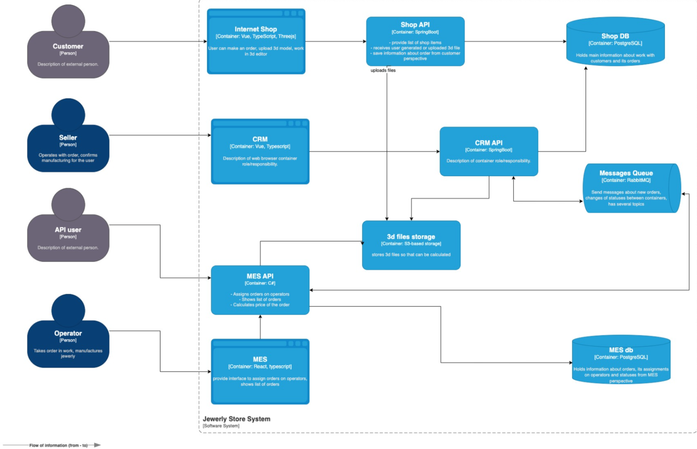

## Повышение отказоустойчивости приложения, кеширование, мониторинг, логирование, трейсинг, метрики производительности

### Архитектура приложения

Распределенная система состоит из следующих приложений:     
- Shop  
  - приложение для заказов(фронт JS-Vue, бек Java-Spring);   
- CRM(Customer Relationship Management)  
  - spa(single page application) приложение для работы с клиентами(фронт JS-Vue, бек Java-Spring);  
- MES(Manufacturing Execution System)  
    - spa-приложение для управления производственными процессами, включая расчет стоимости производства(фронт JS-React, бек C#-Asp.Net);  

CRM и MES взаимодействуют друг с другом через брокер RabbitMQ.  

С ростом нагрузки снижается производительность распределенной системы.  

Для выявления проблемных мест в распределенной системе применяются сбор данных о ее работе посредством
мониторинга, логирования и трейсинга.   

В целях повышения отказоустойчивости приложения применяется кеширование.    

## [Анализ, идентификация проблем и решений, планирование изменения архитектуры](Ex1/Task1.md)    
## [Мониторинг](Ex2/Task2.md)    
## [Трейсинг](Ex3/Task3.md)    
## [Логирование](Ex4/Task4.md)    
## [Кеширование](Ex5/Task5.md)    

